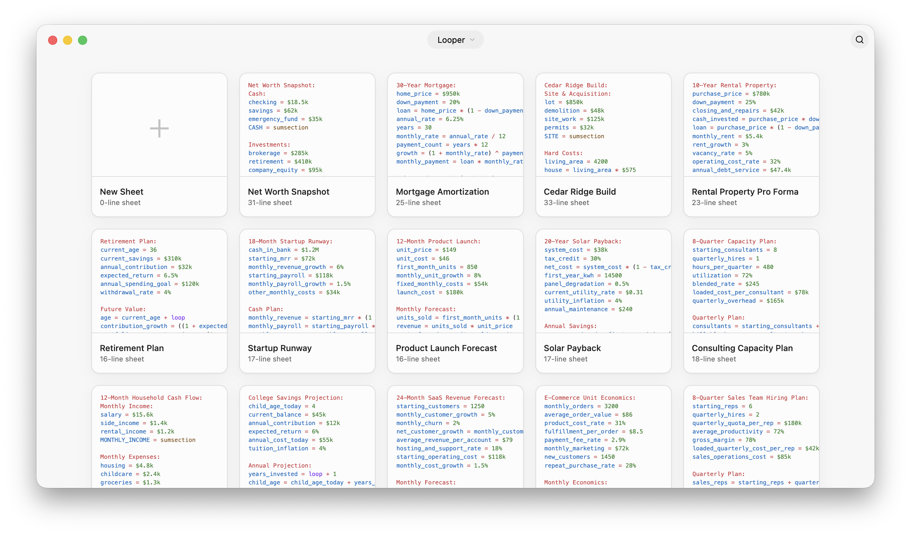
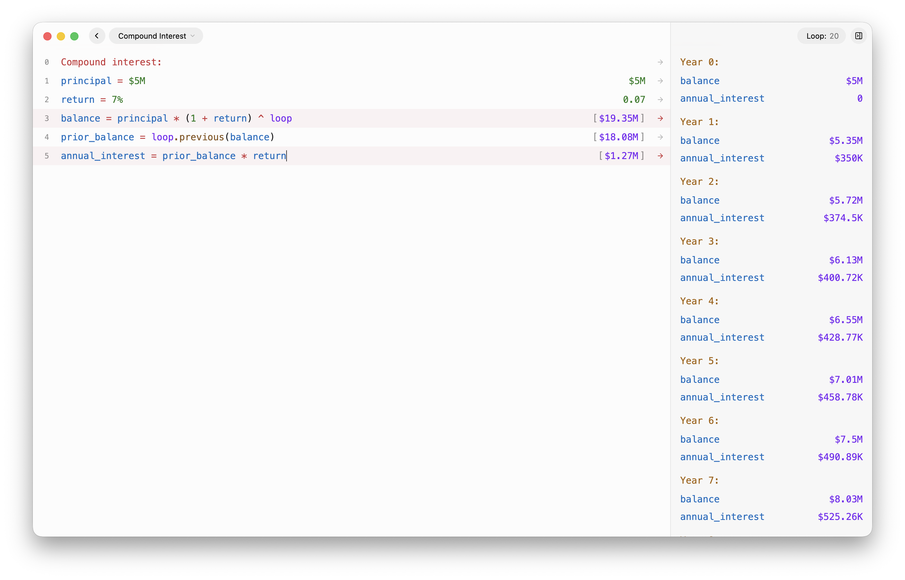

<p align="center">
  
</p>

# Looper

Looper is an open-source notebook calculator for Mac and Windows. Write calculations in a natural, readable sheet, use the magic word `loop` to see how values change over time, and keep the result as a local `.loop` file you control.

[Download Looper](https://looper.app/download) · [Report an issue](https://github.com/rorourke/looper/issues)

<p align="center">
  <picture>
    <source media="(prefers-color-scheme: dark)" srcset="docs/screenshots/looper-library-dark.png">
    <source media="(prefers-color-scheme: light)" srcset="docs/screenshots/looper-library-light.png">
    
  </picture>
</p>

<p align="center">
  
</p>

## What it does

- Evaluates arithmetic, named variables, percentages, currencies, SI suffixes, functions, section summaries, and live stock or crypto prices.
- Turns one calculation into a time series with `loop`, recurrence, and loop-history helpers.
- Includes Looper Basics and reusable templates without copying them into your files until you duplicate one.
- Runs as a focused Electron desktop app on macOS and Windows.
- Requires no account, subscription, payment, or cloud storage.

## Your sheets are files

Looper stores each sheet as a portable `.loop` JSON file. New installs begin in Looper's application-data folder so startup never depends on a protected or cloud-backed Documents directory.

The centered **Looper** menu provides **Open File…**, **Source Folder**, and **Show Source in Finder/File Explorer**. You can import an existing sheet by opening a file or dragging a `.loop` file anywhere onto the app window; Looper copies the imported sheet into the active library folder.

Changing the folder switches Looper to the `.loop` files already in the selected location. Existing files remain in their original folder, so move or copy them yourself when you want to migrate a library.

Existing configured source folders remain unchanged after an update. If you reset Looper's app settings and need to reconnect an older `Documents/Looper` library, choose that folder again with **Source Folder**.

Bundled basics and templates are read-only examples in the app. Duplicating one creates a normal `.loop` file in your selected folder.

## Privacy and network access

Sheet contents stay on your computer. Looper does not provide accounts, cloud sync, sharing, payments, or browser editing.

The app can still make narrowly scoped network requests for:

- live market-price formulas, which send only the ticker symbols used in the sheet;
- application update checks and signed update downloads; and
- the public download page.

## Development

Prerequisites: Node.js 20.9 or newer and pnpm 11.9.

```sh
cd electron
pnpm install
pnpm dev
```

Useful checks:

```sh
cd electron
pnpm test
pnpm typecheck
pnpm build

cd ../web
pnpm install
pnpm test
pnpm build
```

On macOS, `./script/build_and_run.sh` builds, packages, and opens the local app. Public release builds compile internal debug tools out; local development builds can include Demo Time and update-preview controls.

The public repository contains:

- `electron/` — Electron main process, secure preload bridge, React renderer, evaluator, and packaged app configuration.
- `web/` — the public marketing site plus narrowly scoped download, update, health, and market-price endpoints.
- `installer/` — the small native macOS bootstrap that downloads and installs the Electron release; it is not the original native Looper app.
- `script/` — local packaging, signing, updater, and artifact-verification tools.

See [macOS distribution](docs/macos-distribution.md) and
[Windows distribution](docs/windows-distribution.md) for the signed-release
and platform-specific download pipelines.

The original native macOS implementation and the retired account, billing, and cloud-service backend are intentionally not part of this public project.

See [CONTRIBUTING.md](CONTRIBUTING.md) before proposing a substantial change and [SECURITY.md](SECURITY.md) for private vulnerability reporting.

## Author

Ryan is an interaction designer living in Los Angeles. His work can be seen in products from Facebook, Apple, Instagram, and OpenAI. Notably, he spent a decade at Instagram where he helped design the first versions of the reshare, video feeds, stories, close friends, video captions, and was one of the creators of Instagram Threads.

## License

Looper is available under the [MIT License](LICENSE). Third-party components remain subject to their own licenses and notices.
